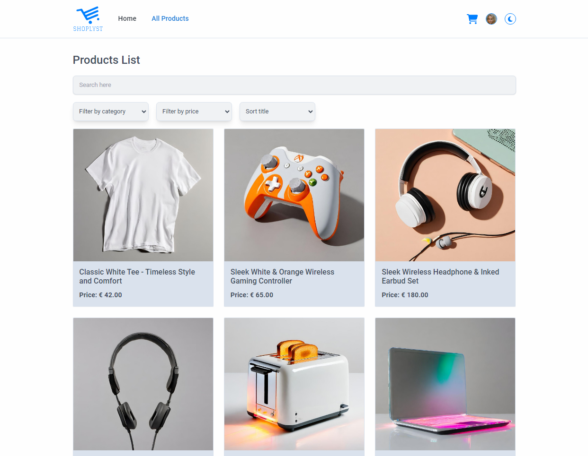
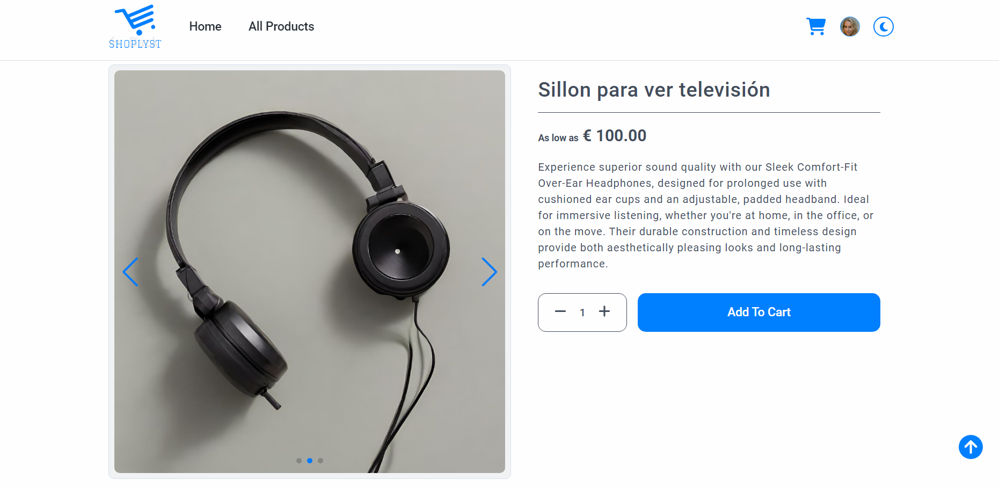
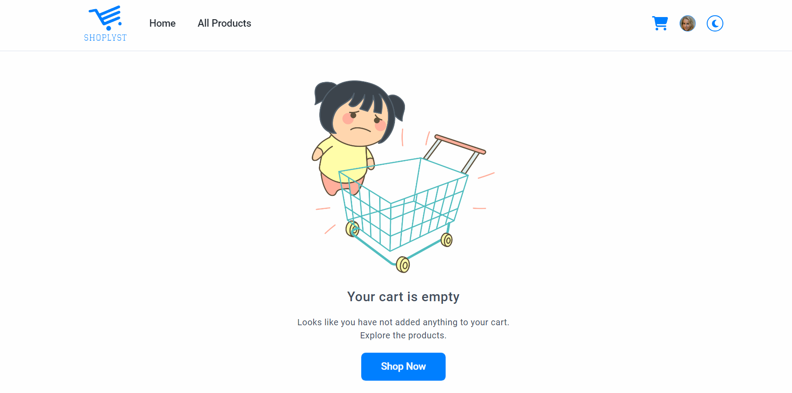
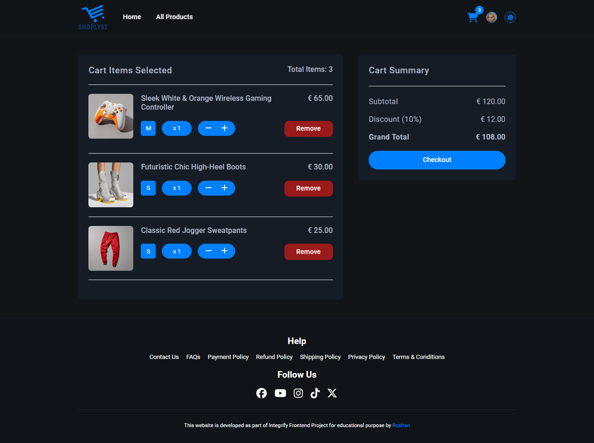
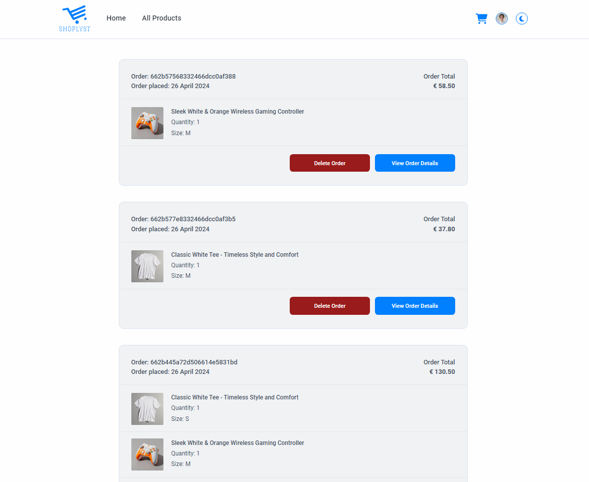
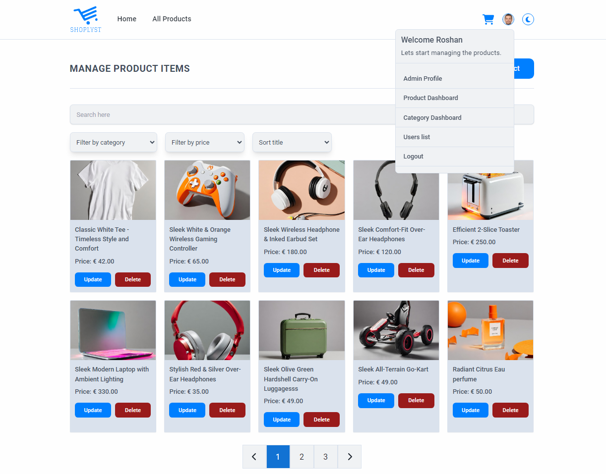
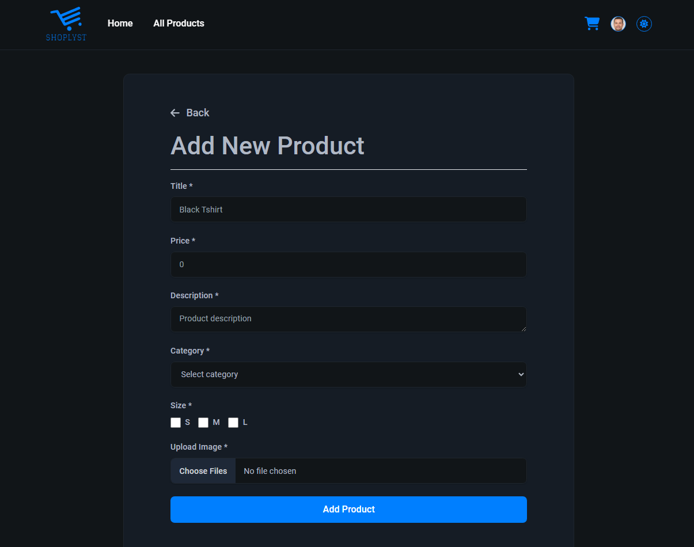
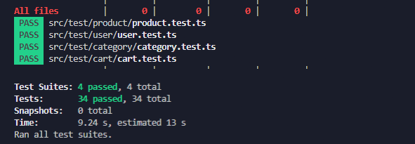

# Frontend project

<p align="center">
  
</p>
<p align="center">
    <h1 align="center">Frontend E-Commerce Project</h1>
</p>
<p align="center">
		<em>Developed with the software and tools below.</em>
</p>
<p align="center">


  
  
  
  
  
</p>

# Shoplyst

'Shoplyst' is a frontend project developed with React, Typescript, Redux Toolkit, React Router Dom, and Tailwind CSS. Its core aim is to offer a user-friendly ecommerce experience, allowing customers to seamlessly explore diverse product categories like electronics, clothing, and furniture for online purchase. Powered by the api developed in Express js with typescript, it ensures dynamic product data, catering to both customer exploration and efficient admin product management with proper authentication. This is a frontedd part of Fullstack Project developed at Integrify 2024. The user interface facilitates both light mode and dark mode for the better user experience.

## Table of Contents

- [Shoplyst](#overview)
- [Explore Shoplyst Live](#explore-shoplyst-live)
- [APP Images](#app-images)
- [Technologies Used](#technologies-used)
- [Getting Started](#getting-started)
- [Project Folder Structure](#project-folder-structure)
- [Features](#features)
  - [Redux Store](#redux-store)
    - [User Reducer](#user-reducer)
    - [Product Reducer](#product-reducer)
    - [Category Reducer](#category-reducer)
    - [Cart Reducer](#cart-reducer)
    - [Order Reducer](#order-reducer)
  - [Toast Notifications](#toast-notifications)
  - [Responsive Design](#responsive-design)
  - [Testing](#testing)
- [Deployment](#deployment)

## Explore Shoplyst Live

[](https://ecommerce-shoplyst.vercel.app/)

## APP Images












## Technologies Used

- **TypeScript**
- **Redux Toolkit**
- **React**
- **React Router**
- **Tailwind CSS**
- **Swiper Js**
- **React Paginate**
- **Lodash**
- **Toastify**
- **UseContext - Theme Toggle**
- **React Hook Form**: Form handling library for React applications.

## Getting Started

# Prerequisite

Ensure you have the following dependencies installed on your system:

- TypeScript: ^4.9.5
- React: ^18.2.0

1. Clone the repository.

```bash
git clone https://github.com/roshanbist/fullstack-ecommerce-frontend.git

```

2. Navigate to the project directory.

   ```bash
   cd fullstack-ecommerce-frontend

   ```

3. Install dependencies.

   ```bash
   npm install
   ```

4. To start the App
   ```bash
   npm start
   ```
5. To run the tests:
   ```bash
   npm test
   ```

## Project Folder Structure

```
└── 📁src
    └── App.tsx
    └── 📁assets
        └── 📁images
            └── avatar.png
            └── banner.jpg
            └── empty-cart.png
            └── logo.svg
            └── productPlaceholder.png
    └── 📁components
        └── 📁adminContent
            └── 📁category
                └── AddNewCategory.tsx
                └── AdminCategoryCard.tsx
                └── AdminCategoryDashboard.tsx
                └── UpdateCategory.tsx
            └── 📁product
                └── AddNewProduct.tsx
                └── AdminProductCard.tsx
                └── ProductDashboard.tsx
                └── UpdateProduct.tsx
            └── 📁users
                └── UsersList.tsx
                └── UsersTable.tsx
        └── 📁banner
            └── Banner.tsx
        └── 📁cart
            └── CartButton.tsx
            └── CartDetail.tsx
            └── CartItem.tsx
            └── CartSummary.tsx
            └── EmptyCart.tsx
        └── 📁contentWrapper
            └── ContentWrapper.tsx
        └── 📁contextAPI
            └── ColorThemeContext.tsx
        └── 📁footer
            └── Footer.tsx
        └── 📁goBackButton
            └── GoBackButton.tsx
        └── 📁header
            └── Header.tsx
        └── 📁loader
            └── Loader.tsx
        └── 📁navbar
            └── Navbar.tsx
        └── 📁newsletter
            └── Newsletter.tsx
        └── 📁noMatchFound
            └── NoMatchFound.tsx
        └── 📁order
            └── OrderDetail.tsx
            └── OrderInfo.tsx
        └── 📁pagination
            └── Pagination.tsx
        └── 📁product
            └── ProductCard.tsx
            └── ProductDescription.tsx
            └── ProductGallery.tsx
            └── ProductHighlights.tsx
        └── 📁protectedRoute
            └── ProtectedRoute.tsx
        └── 📁scrollTop
            └── ScrollTop.tsx
        └── 📁themeToggle
            └── ThemeToggle.tsx
        └── 📁user
            └── EditProfile.tsx
            └── UpdatePassword.tsx
            └── UserInteraction.tsx
            └── UserInteractionDropdown.tsx
            └── UserProfile.tsx
    └── 📁constants
        └── index.ts
    └── index.css
    └── index.tsx
    └── logo.svg
    └── 📁pages
        └── AdminProfile.tsx
        └── Cart.tsx
        └── CustomerProfile.tsx
        └── Home.tsx
        └── index.ts
        └── Login.tsx
        └── MyOrderList.tsx
        └── PageNotFound.tsx
        └── ProductDetail.tsx
        └── Products.tsx
        └── Register.tsx
    └── react-app-env.d.ts
    └── 📁redux
        └── 📁slices
            └── CartSlice.ts
            └── CategorySlice.ts
            └── OrderSlice.ts
            └── ProductSlice.ts
            └── UserSlice.ts
        └── store.ts
    └── reportWebVitals.ts
    └── setupTests.ts
    └── 📁test
        └── 📁cart
            └── cart.test.ts
        └── 📁category
            └── category.test.ts
        └── 📁product
            └── product.test.ts
        └── 📁user
            └── user.test.ts
    └── 📁types
        └── Cart.ts
        └── Category.ts
        └── orderList.ts
        └── Pagination.ts
        └── Product.ts
        └── User.ts
    └── 📁utils
        └── api.ts
        └── commonUtil.ts
        └── ImageUrlClear.ts
        └── uploadFile.ts
        └── uploadFileService.ts
```

# Features

## Redux Store

### User Reducer

- **Register user**
- **Login user**
- **Get all user (Admin access required)**
- **Get single user by Id**
- **Update user**
- **Update password**
- **Delete user by id (Admin access required)**

### Product Reducer

- **Get all products**
- **Get a single product**
- **Filter products by title, categories, and price**
- **CRUD Operation for product (Admin access required)**

### Category Reducer

- **Get all categories**
- **CRUD Operation for category (Admin access required)**

### Cart Reducer

- **Add product to cart**
- **Remove product from cart**
- **Update product quantity in the cart**

### Order Reducer

- **Get all Order**
- **Get detail of single order**
- **Delete order by order id**

### Toast Notifications

This application offers seamless interaction with a notification feature, that keep users updated on every action they take. Whether it's adding or removing products from the cart, placing orders, users stay informed directly from the User Interface.

### Responsive Design

This application ensures a seamless experience across all devices, adapting effortlessly to various screen sizes facilitating usability on the go. Whether on a smartphone or tablet, or desktop users can navigate and interact with ease.

### Testing

All the reducers are tested (productSlice, userSlice, cartSlice, categorySlice)
Total 34 tests runs and passed in 4 test suites.

```bash
   npm test
```



## Deployment

The application is deployed on vercel. Clicke here to see the [Live Demo](https://ecommerce-shoplyst.vercel.app/)
