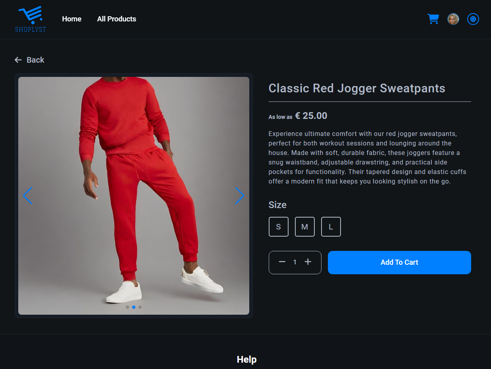
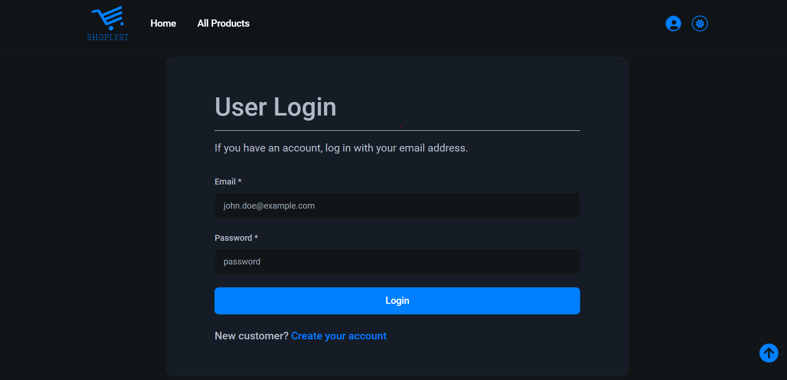

# Frontend project

<p align="center">
  
</p>
<p align="center">
    <h1 align="center">Frontend E-Commerce Project</h1>
</p>
<p align="center">
		<em>Developed with the software and tools below.</em>
</p>
<p align="center">
	
	
  
  
  
  
  
</p>

# Shoplyst

'Shoplyst' is a frontend project developed with React, Typescript, Redux Toolkit, React Router Dom, and Tailwind CSS. Its core aim is to offer a user-friendly ecommerce experience, allowing customers to seamlessly explore diverse product categories like electronics, clothing, and furniture for online purchase. Powered by the [Platzi Fake Store API](https://fakeapi.platzi.com/), it ensures dynamic product data, catering to both customer exploration and efficient admin product management.

## Table of Contents

- [Overview](#overview)
- [Explore Shoplyst Live](#explore-shoplyst-live)
- [APP Images](#app-images)
- [Technologies Used](#technologies-used)
- [Getting Started](#getting-started)
- [Project Folder Structure](#project-folder-structure)
- [Features](#features)
  - [Redux Store](#redux-store)
    - [User Reducer](#user-reducer)
    - [Product Reducer](#product-reducer)
    - [Cart Reducer](#cart-reducer)
  - [Theme Toggle (Light/Dark mode)](#theme-toggle-light-dark-mode)
  - [Toast Notifications](#toast-notifications)
  - [Responsive Design](#responsive-design)
- [Testing](#testing)
- [API Endpoint](#api-endpoint)
- [Scripts](#scripts)
- [Deployment](#deployment)
- [License](#license)

## Explore Shoplyst Live

[](https://ecommerce-shoplyst.vercel.app/)

## APP Images






## Technologies Used

- **TypeScript**
- **Redux Toolkit**
- **React**
- **React Router**
- **Tailwind CSS**
- **Swiper Js**
- **React Paginate**
- **Lodash**
- **Toastify**
- **UseContent- Theme Toggle**
- **React Hook Form**: Form handling library for React applications.

## Getting Started

# Prerequisite

Ensure you have the following dependencies installed on your system:

- TypeScript: ^4.9.5
- React: ^18.2.0

1. Clone the repository.

```bash
git clone https://github.com/roshan/fs17-Frontend-project.git

```

2. Navigate to the project directory.

   ```bash
   cd fs17-Frontend-project

   ```

3. Install dependencies.

   ```bash
   npm install
   ```

4. To start the App
   ```bash
   npm start
   ```
5. To run the tests:
   ```bash
   npm test
   ```

## Project Structure

```
└── .gitignore
└── package.json
└── 📁public
    └── favicon.ico
    └── index.html
└── README.md
└── 📁src
    └── App.tsx
    └── 📁assets
        └── 📁images
            └── avatar.png
            └── banner.jpg
            └── empty-cart.png
            └── logo.svg
            └── productPlaceholder.png
    └── 📁components
        └── 📁adminContent
            └── AddNewProduct.tsx
            └── AdminProductCard.tsx
            └── ProductDashboard.tsx
            └── UpdateProduct.tsx
        └── 📁banner
            └── Banner.tsx
        └── 📁cart
            └── CartButton.tsx
            └── CartDetail.tsx
            └── CartItem.tsx
            └── CartSummary.tsx
            └── EmptyCart.tsx
        └── 📁contentWrapper
            └── ContentWrapper.tsx
        └── 📁contextAPI
            └── ColorThemeContext.tsx
        └── 📁footer
            └── Footer.tsx
        └── 📁goBackButton
            └── GoBackButton.tsx
        └── 📁header
            └── Header.tsx
        └── 📁loader
            └── Loader.tsx
        └── 📁navbar
            └── Navbar.tsx
        └── 📁newsletter
            └── Newsletter.tsx
        └── 📁noMatchFound
            └── NoMatchFound.tsx
        └── 📁pagination
            └── Pagination.tsx
        └── 📁product
            └── ProductCard.tsx
            └── ProductDescription.tsx
            └── ProductGallery.tsx
            └── ProductHighlights.tsx
        └── 📁protectedRoute
            └── ProtectedRoute.tsx
        └── 📁scrollTop
            └── ScrollTop.tsx
        └── 📁themeToggle
            └── ThemeToggle.tsx
        └── 📁user
            └── EditProfile.tsx
            └── UserInteraction.tsx
            └── UserInteractionDropdown.tsx
            └── UserProfile.tsx
    └── 📁constants
        └── index.ts
    └── 📁hook
        └── usePagination.ts
    └── index.css
    └── index.tsx
    └── logo.svg
    └── 📁pages
        └── Admin.tsx
        └── Cart.tsx
        └── CustomerProfile.tsx
        └── Home.tsx
        └── index.ts
        └── Login.tsx
        └── PageNotFound.tsx
        └── ProductDetail.tsx
        └── Products.tsx
        └── Register.tsx
    └── react-app-env.d.ts
    └── 📁redux
        └── 📁slices
            └── CartSlice.ts
            └── CategorySlice.ts
            └── ProductSlice.ts
            └── UserSlice.ts
        └── store.ts
    └── reportWebVitals.ts
    └── setupTests.ts
    └── 📁test
        └── 📁cart
            └── cart.test.ts
        └── 📁category
            └── category.test.ts
        └── 📁product
            └── product.test.ts
        └── 📁user
            └── user.test.ts
    └── 📁types
        └── Cart.ts
        └── Category.ts
        └── Pagination.ts
        └── Product.ts
        └── User.ts
    └── 📁utils
        └── ImageUrlClear.ts
        └── uploadFile.ts
        └── uploadFileService.ts
└── tailwind.config.js
└── tsconfig.json
```

# Features

## Redux Store

### User Reducer

- **Register User**
- **Login User**

### Product Reducer

- **Get all products**
- **Find a single product**
- **Filter products by price**
- **Filter product by categories**
- **CRUD Operation**

### Cart Reducer

- **Add product to cart**
- **Remove product from cart**
- **Update product quantity in the cart**

### Theme toggle (Light / Dark mode)

### Toast Notifications

### Responsive Design

## API Endpoint

- Use the API endpoint [Platzi Fake Store API](https://fakeapi.platzi.com/).

## Deployment

The application is deployed on vercel. Clicke here to see the [Live Demo](https://ecommerce-shoplyst.vercel.app/)
